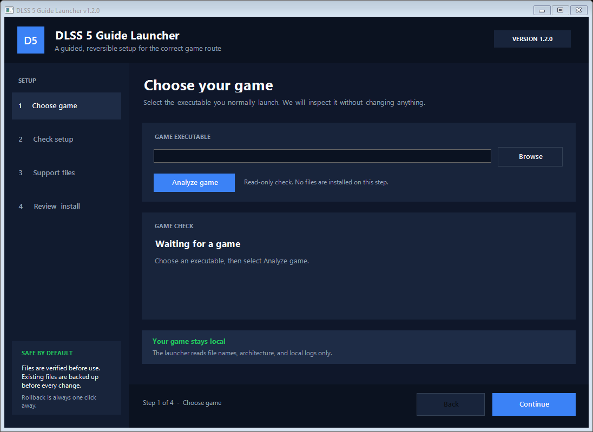

# DLSS 5 Guide Launcher — No-Admin VM Edition

A transparent Windows wizard that selects the correct community DLSS 5 Neural Rendering setup for a 64-bit game. This fork is designed for a standard Windows account: it never requests elevation and can reuse or import ReShade without launching its installer.



It does **not** include NVIDIA DLLs, patched RTX 40 files, ReShade, RenoDX, Bridge, Feeder, or motion-estimation binaries. The PowerShell source is the program; there is no hidden executable.

Do not copy an old or unknown Discord Bridge binary into this package. When the Bridge route is selected, the launcher obtains the current release directly from the official Bridge repository and verifies its GitHub-published digest.

## What the launcher chooses

| GPU | Game API and DLSS support | Route |
| --- | --- | --- |
| RTX 50 series | DirectX 12 + native DLSS | Core RenoDX DLSS 5 files only |
| RTX 50 series | DirectX 11 + native DLSS | Core files + official DX11 Bridge |
| RTX 50 series | DirectX 11/12 + no native DLSS | Core files + official DLSS5-Feeder + LumeniteFX Kernel |
| RTX 40 series | Same choices | Experimental equivalents using **your own patched** `nvngx_dlssnr.dll` |
| Other GPUs | Any | Blocked |

Bridge and Feeder solve different problems and are never installed together:

- **DX11 Bridge** is only for a DX11 game that already calls DLSS.
- **DLSS5-Feeder** is for a DX11 or DX12 game that never shipped with DLSS.
- A native DX12 DLSS game needs neither.

## Before running it

1. Close the game.
2. Obtain the RenoDX DLSS 5/Streamline package from the community guide you trust.
3. Put your user-supplied files in one folder. The launcher looks recursively for:
   - `renodx-dlss5.addon64`
   - `nvngx_dlssnr.dll`
   - `nvngx_dlss.dll` (needed by Feeder when the game has no copy)
4. For RTX 40 series only, the model DLL is an unofficial patched binary. The launcher does not supply it and requires an explicit warning acknowledgement.
5. Optional: keep a known-good 64-bit **ReShade full add-on** runtime DLL available. This can be copied from another game where the same ReShade build already works. If the target game already has ReShade as `dxgi.dll`, the launcher reuses it automatically.

A fresh game download does not automatically provide the correct DLSS 5 model. “Fresh” only means the files match that game's distributor; the launcher still validates the selected source.

## Use

1. Extract this entire folder.
2. Double-click `DLSS5-Guide-Launcher.cmd`.
3. On **Choose game**, select the actual game `.exe`, not only the library/root folder, then click **Analyze game**.
4. On **Check setup**, confirm the graphics API and whether the game already has native DLSS. The recommended route updates immediately.
5. On **Support files**, select the folder containing your RenoDX add-on and NVIDIA DLLs. For ReShade, either leave the optional field blank to reuse the target game's existing `dxgi.dll`, or select a local 64-bit full-add-on ReShade runtime DLL.
6. On **Review & install**, read the exact file plan and click **Install now**. ReShade and the route-specific community components are obtained automatically.

The left side always shows where you are. Completed steps stay available, advanced actions remain on the final page, and progress is shown during downloads and installation.

The ReShade order is: reuse a recognized `dxgi.dll` already beside the game executable; otherwise use the local runtime you selected; otherwise download, verify, and headlessly stage the official ReShade 6.8.0 full add-on installer as a fallback. The first two routes never start the ReShade installer. DXGI is the ReShade proxy used for the launcher's DirectX 11 and DirectX 12 routes; Bridge/Core/Feeder selection is separate. Windows metadata can prove that a DLL is ReShade and its PE header can prove that it is 64-bit, but cannot distinguish the standard build from the full add-on build; select a runtime you know came from the full add-on package.

For the Feeder route, it also installs the standard `ReShade.fxh` include from a pinned commit of ReShade's official shader repository. Headless ReShade setup does not install that shader dependency itself. The generated shader and texture search paths are normalized to ReShade's valid recursive Windows form (`...\**`, not `...\**\**`).

The launcher performs a write/delete probe in the selected game folder before downloading dependencies. If Windows returns error 5, no game files are changed and the launcher does **not** suggest elevation. Put the game in a user-writable library (for example `C:\Games` only if your account owns that folder), or have the VM owner grant your account Modify permission to that one game folder.

If the official ReShade child installer is blocked by VM policy, select a known-good local ReShade full-add-on runtime in the wizard. If error 5 happens before the launcher window appears, the VM is blocking PowerShell itself; a PowerShell script cannot bypass that policy, so the VM owner must allow the signed/approved launcher or provide an approved deployment channel.

For a Feeder install, the launcher creates or merges `ReShadePreset.ini`, enables **LUMENITE: Kernel 2.0**, and places **DLSS 5 Feed** directly below it. It also adds `DLSS5_MV_PROVIDER=3` to `ReShade.ini` while preserving existing definitions and techniques. After launching, open ReShade and enable Neural Rendering in the DLSS 5 panel.

There is no second interactive ReShade setup window and the user does not have to choose the API twice. If another ReShade proxy (`d3d11.dll` or `d3d12.dll`) is detected, the launcher backs it up and removes it before installing `dxgi.dll`. If the game already has a `dxgi.dll` that is not ReShade, installation stops instead of overwriting an unknown mod loader; that uncommon setup requires manual proxy chain-loading.

## Safety and rollback

- Official Bridge and Feeder assets are resolved through GitHub's latest-release API and checked against GitHub's published SHA-256 digest.
- The ReShade installer must carry the exact certificate thumbprint published on reshade.me. Because that certificate is self-signed, Windows may label its otherwise intact signature `UnknownError`/untrusted root; a missing signature, hash mismatch, or different thumbprint is rejected.
- RTX 50 mode refuses a model DLL without a valid NVIDIA signature.
- RTX 40 mode clearly labels the model as unofficial and never downloads it.
- Replaced or removed game files—including the ReShade runtime and configuration—are copied to `%LOCALAPPDATA%\DLSS5-Guide-Launcher\Backups` first.
- **Rollback last install** restores that backup. A file added by the launcher is deleted only if its hash still matches what the launcher installed.
- Logs are in `%LOCALAPPDATA%\DLSS5-Guide-Launcher\Logs`.

No malware scanner or source review can promise “100% safe.” Read the script, download dependencies only from the linked projects, scan your user-supplied files, and avoid multiplayer/anti-cheat games unless their rules explicitly permit ReShade and add-ons.

## Feeder limitations

Feeder is beta. In a game without native DLSS it currently provides DLAA rather than performance upscaling. Estimated motion vectors can create ghosting, and the HUD is processed. It is not the same tool as the DX11 Bridge and should not be combined with it. NVIDIA Smooth Motion and OptiScaler can also conflict with it.

Feeder 0.6 changed its recommended provider to LumeniteFX Kernel. The older ReShade Motion Estimation/DRME provider can fail to compile on ReShade 6.8 and silently provide zero vectors, so this launcher deliberately does not install it.

To prevent a future guide change from silently selecting the wrong provider, version 1.2.0 accepts Feeder 0.6.x, pins the tested official LumeniteFX commit `4615b30a277e5525e25581f5a37728cecac33399`, and pins official `ReShade.fxh` commit `6db142b4b1a05c764222e5b0bd9a644b7ccfe1dc`. A later Feeder series will require a launcher update.

Version 1.3.0-noadmin automates only 64-bit DirectX 11 and DirectX 12 routes. It does not install Vulkan layers or write Vulkan registry keys. Vulkan and DirectX 9 remain advanced/manual routes.

## Official project links

- ReShade: <https://reshade.me/>
- DLSS5-Feeder: <https://github.com/jlrouzies-fr/DLSS5-Feeder>
- DLSS 5 DX11 Bridge: <https://github.com/NIGos/dlss5-dx11-bridge>
- LumeniteFX: <https://github.com/umar-afzaal/LumeniteFX>
- RHI (optional alternative manager): <https://github.com/RankFTW/RHI>

The launcher is an independent community helper. It is not affiliated with or endorsed by NVIDIA, ReShade, RenoDX, or the linked projects.

## Headless validation

Decision-matrix self-test:

```powershell
powershell -NoProfile -ExecutionPolicy Bypass -File .\DLSS5-Guide-Launcher.ps1 -SelfTest
```

Dry-run example (does not download or alter game files):

```powershell
powershell -NoProfile -ExecutionPolicy Bypass -File .\DLSS5-Guide-Launcher.ps1 `
  -Headless -DryRun `
  -GameExe 'C:\Games\Example\game.exe' `
  -GpuClass 'RTX 50 series' `
  -GraphicsApi 'DirectX 11' `
  -NativeDlss Yes `
  -SupportFiles 'C:\Users\You\Downloads\DLSS5-support' `
  -ReShadeRuntime 'C:\Users\You\Downloads\ReShade64.dll'
```

## License

The launcher source is licensed under MIT. Downloaded third-party components keep their own licenses and are not part of this package.
